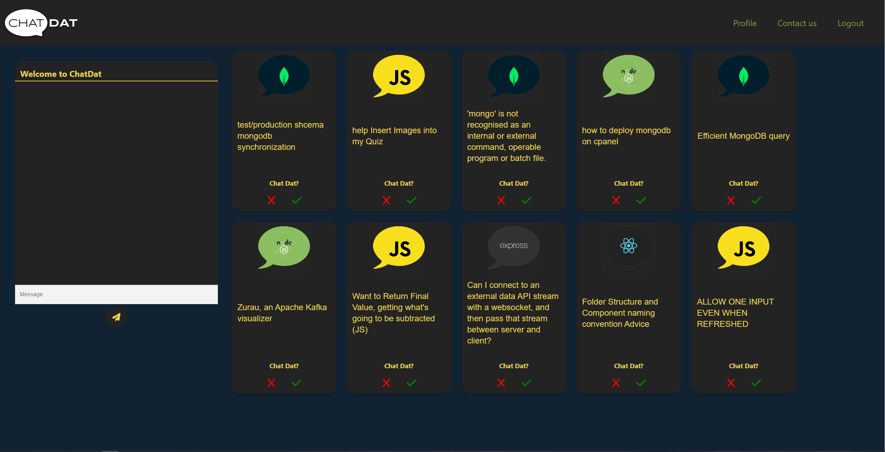

# Chatdat

---

Chatdat is a web application to help improve yourself as a developer, and also help other developers that are starting in their journey. Chatdat pulls different discussion topics from different subreddits, and displays them to the user. The user can then click on the links to the discussion, and then can send the topic to other users in the app. Chatdat uses technologies such as React, JavaScript, MaterialUi, Node, HTML, JSX, and CSS

## Usage

---

To use the application, the user must simply create an account, and then log-in. Once they have logged in, the user will be presented with 10 different options for discussion. The topics are an assortment of different MERN stack tecnologies. MongoDB, Expressjs, React, and Nodejs. The user can then accept or decline the topic. When they accept the topic, it will then be presented in the chatBox, and then the discussion can begin with the other users that are on the site.

## Screenshot

---

## Deployed Application

---

[Chatdat](https://chat-dat.herokuapp.com/)

## Contact Us

---

[Brandon](https://github.com/brandonelliott0530)
[Quy](https://github.com/QNguyen-hub)
[Justin](https://github.com/noellerjd)
[Edward](https://github.com/Eddie-M11)
[Andrew](https://github.com/AndrewDamron)
